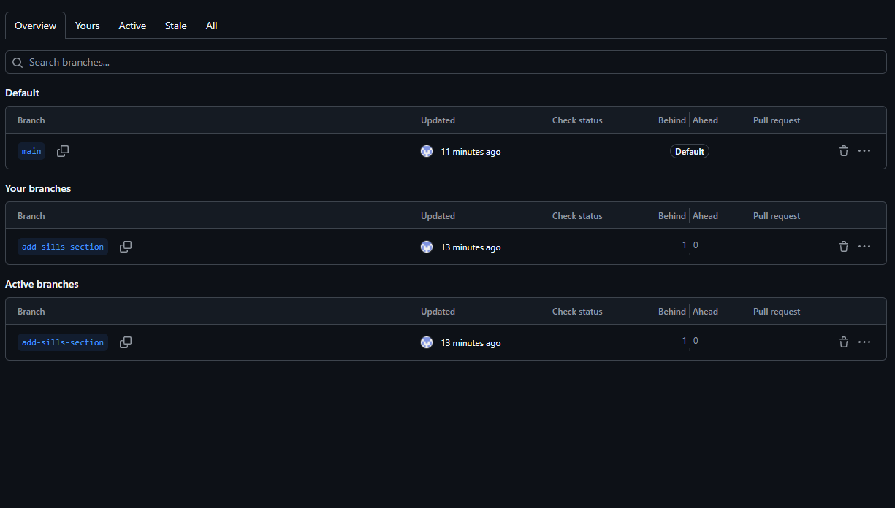

# Отчет по работе в команде

**Дата:** [дата выполнения]  
**Команда:**  [Денис Чернаков (tigris8735)] и [Савчук Александр (wFhalyava97-cpu)]

## Распределение задач:
- **Студент 1:** [tigris8735] - раздел "Навыки"
- **Студент 2:** [wFhalyava97-cpu] - раздел "Контакты"

## Выполненные действия:

### Создание веток:
- Ветка студента 1: `add-skills-section` ✅
- Ветка студента 2: `add-contacts-section` ✅

### Реализация функционала:
- [+] Студент 1: раздел "Навыки" добавлен
- [+] Студент 2: форма "Контакты" добавлена

### Коммиты:
- Сообщение коммита студента 1: [введите сообщение]
- Сообщение коммита студента 2: [введите сообщение]
- [+] Оба коммита отправлены на GitHub

## Проверка работы:
1. Переключитесь между ветками: `git checkout [имя-ветки]`
2. [+] В каждой ветке видны только соответствующие изменения
3. [+] Страница работает корректно в каждой ветке

## Скриншоты:

## Проблемы и решения:
[Опишите проблемы при работе с ветками]

## Вывод:
[Что узнали о работе с ветками в Git]