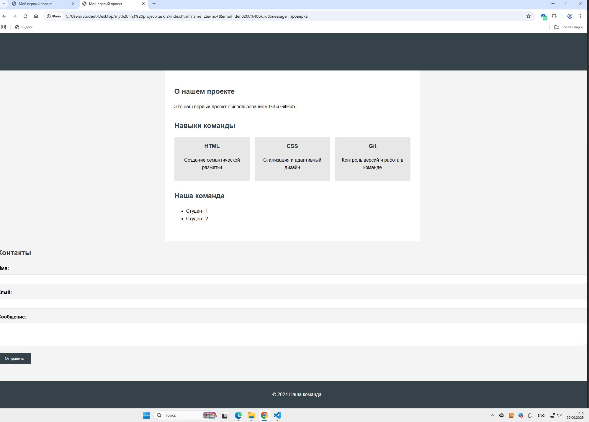

# Отчет по слиянию изменений

**Дата:** [дата выполнения]  
**Команда:**  [Денис Чернаков (tigris8735)] и [Савчук Александр (wFhalyava97-cpu)]

## Выполненные действия:

### Pull Requests:
- PR студента 1: [[ссылка на PR](https://github.com/tigris8735/task_2/pull/1)] ✅
- PR студента 2: [[ссылка на PR](https://github.com/tigris8735/task_2/pull/1)] ✅

### Code Review:
- [+] Оба PR проверены
- [+] Оба PR approved

### Слияние:
- [+] Оба PR успешно слиты в main
- [+] Ветки удалены на GitHub (опционально)

### Обновление локальной копии:
- [+] Локальная ветка main обновлена
- [+] Все изменения присутствуют

## Проверка финального результата:
1. Откройте index.html в браузере
2. [+] Раздел "Навыки" отображается
3. [+] Форма "Контакты" отображается
4. [+] Все стили работают корректно

## Скриншоты:

## Проблемы и решения:
[Опишите проблемы при слиянии и как их решили]

## Вывод:
[Что узнали о процессе Code Review и слиянии изменений]